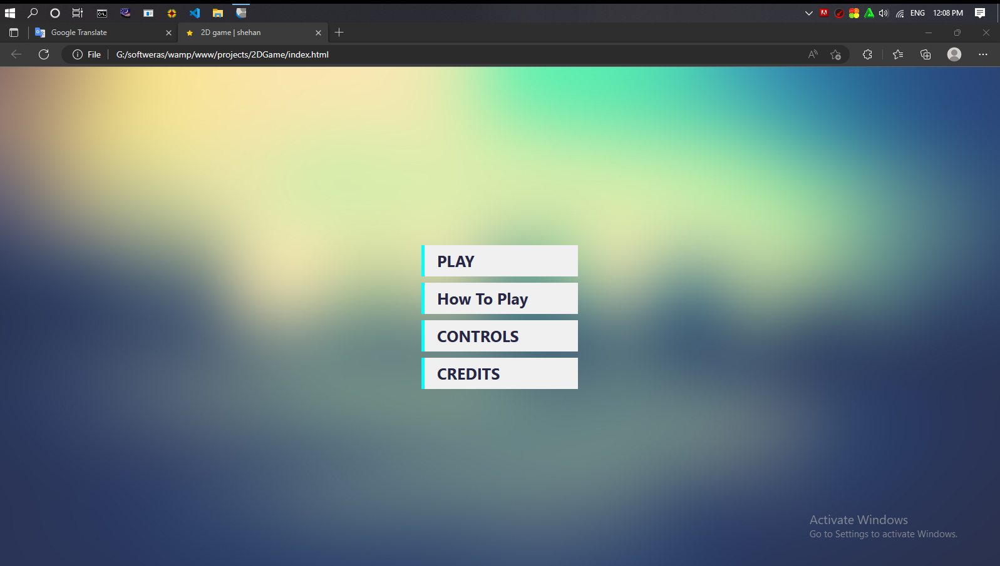
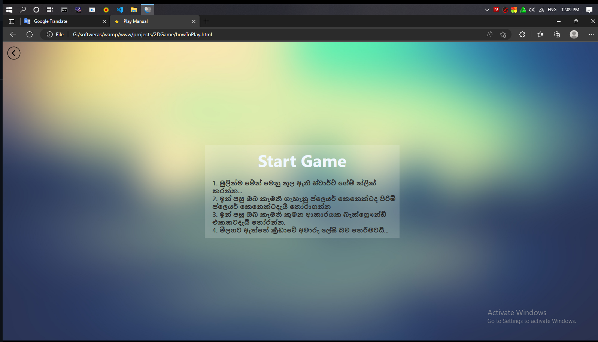
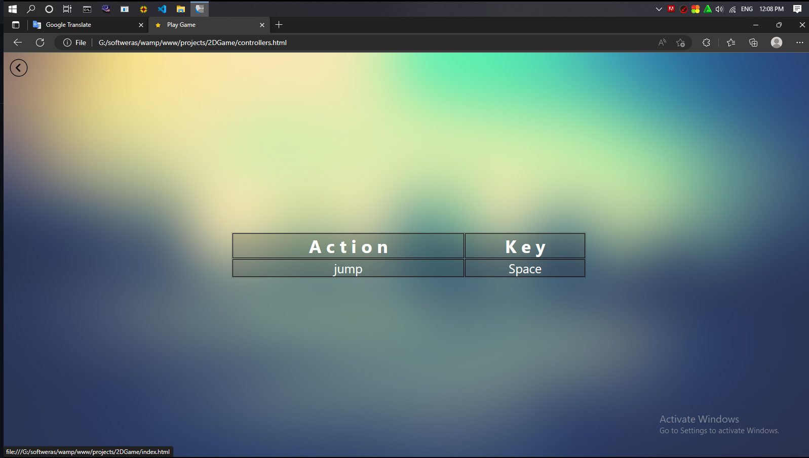
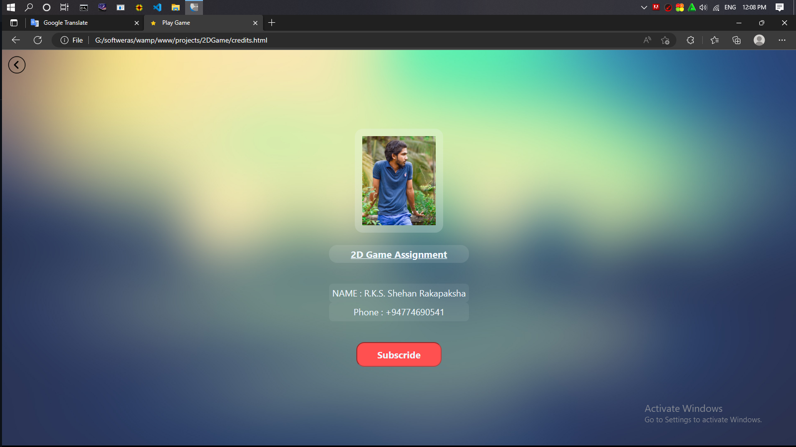
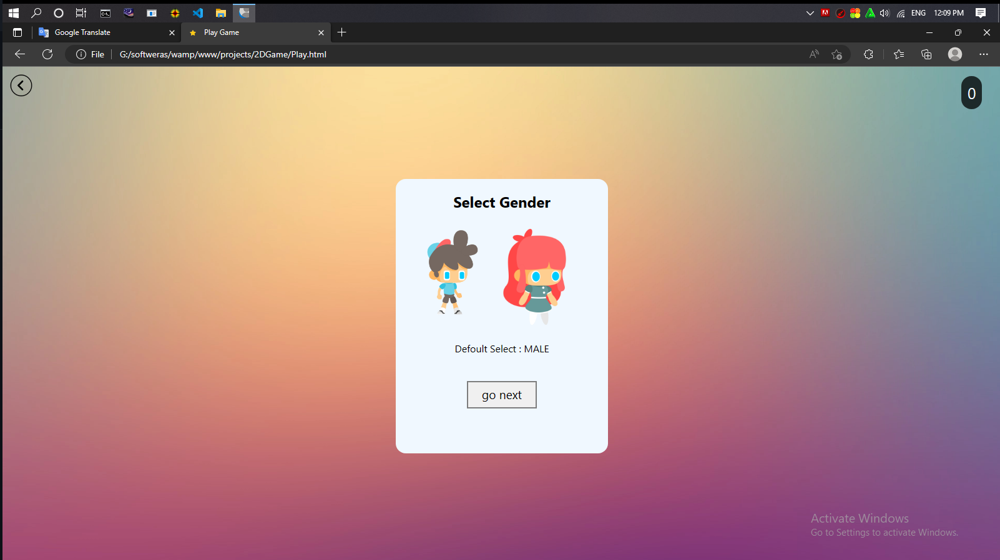
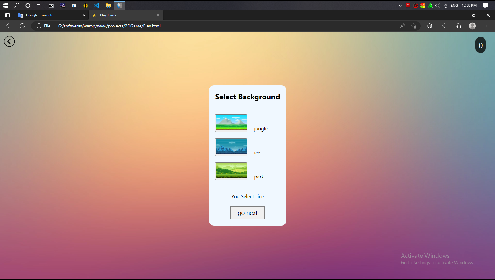
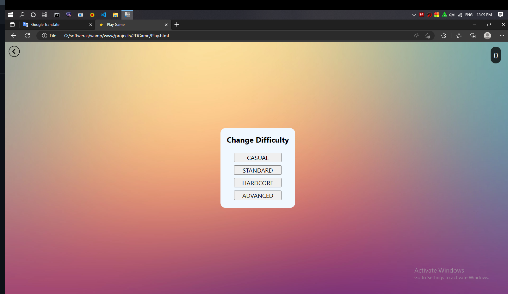
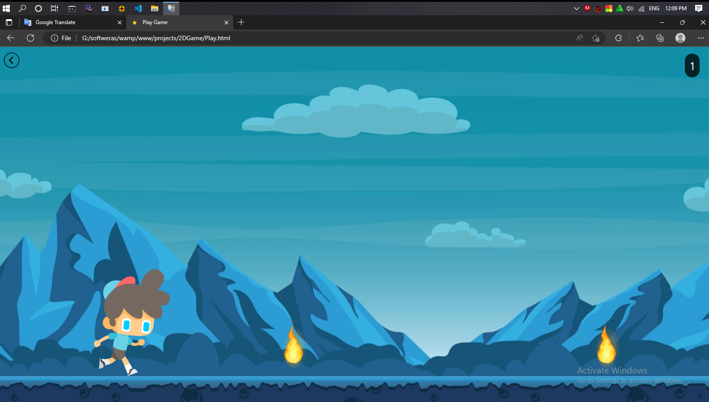
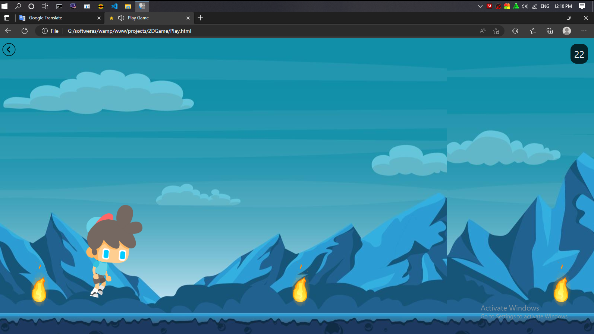
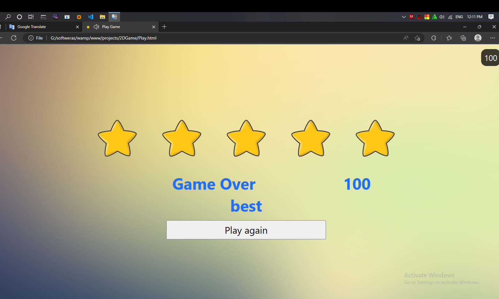

# 2D-game-HTML-CSS-Java-Script
2D game created using HTML, CSS and JavaScript

<i> Created using HTML, CSS and JavaScript, this web game is yet to be completed. Created for computers only. Can be played for mobile too but not enough. </i>

<h2>Why was it created in several languages?</h2>
<li><b>HTML</b> - <i>Web page creation is done using HTML language.</i></li>
<li><b>CSS</b> - <i>The page created by HTML is made beautiful by CSS</i></li>
<li><b>Java Script</b> - <i>HTML-generated pages are programmed using Java Script.</i></li>

<h2>Pages in the game</h2>
<li><b>PLAY <u>(index.html)</u> </b> - <i>The page where the main menu is created(The game is on (<u>Play.html</u>)</i></li>
<li><b>HOW TO PLAY <u>(howToPlay.html)</u> </b> - <i>Here is how to play this game in <a href="https://en.wikipedia.org/wiki/Sinhala_language">Sinhala </a>language</i></li>
<li><b>CONTROLS <u>(controllers.html)</u> </b> - <i>Here are the keyboard keys required for the game</i></li>
<li><b>CREDITS <u>(credits.html)</u></b> - <i>Here is about <a href="https://shehan774690541@gmail.com/">me</a> who created this game</i></li>

<h2>How to open the game.</h2>
<li>First, open the index.html file.</li>
<li>Click the play button and open the gender select menu.</li>
<li>Choose whether you prefer a boy or a girl. The default selection is male.</li>
<li>Select Girl or Boy and click Go Next button <b>*twice</b>.</li>
<li>Choose which background you want to play in. You are given 3 backgrounds namely Jungle, Ice and Park.</li>
<li>Choose which background you like and give go next. If nothing is selected, the park background is automatically selected</li>
<li>Choose a mode that suits your skill level in the difficulty menu</li>
<li>Once you select the difficulty level you want, an alt will give you a description of the difficulty level. Once that is done, the game is reversed</li>

<h2>Difficulty Menu</h2>
<li><b>CASUAL</b> - <i>very slow  Very easy to play.  Gameplay is sloppy</i></li>
<li><b>STANDARD</b> - <i>very slow  Very easy to play.  Gameplay is sloppy</i></li>
<li><b>HARDCORE</b> - <i>The speed is quite high.  Takes a competitive style.  Quite tiring</i></li>
<li><b>ADVANCED</b> - <i>The speed is too high.  Difficult to play.  For skilled players</i></li>

<h1>
<a href="https://youtu.be/xvsQJ_ONT6U">Watch On Youtube</a>
</h1>

<h2>Image Manual</h2>

<h3>Main Menu</h3>

<h3>Manual</h3>

<h3>Controles</h3>

<h3>Credit</h3>

<h3>Gender Select Menu</h3>

<h3>Background Select Menu</h3>

<h3>difficulty Select Menu</h3>

<h3>Playing Game -1</h3>

<h3>Playing Game -2</h3>

<h3>Game Over</h3>

